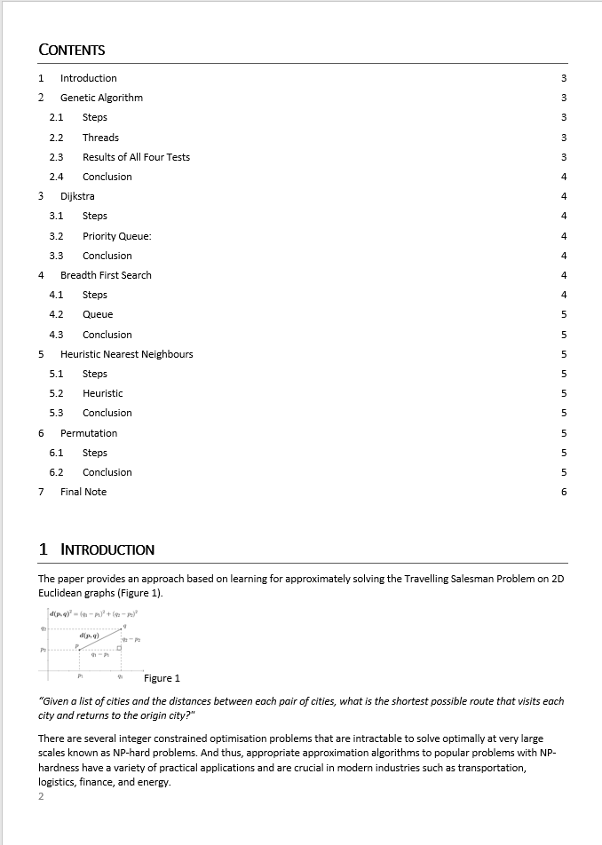
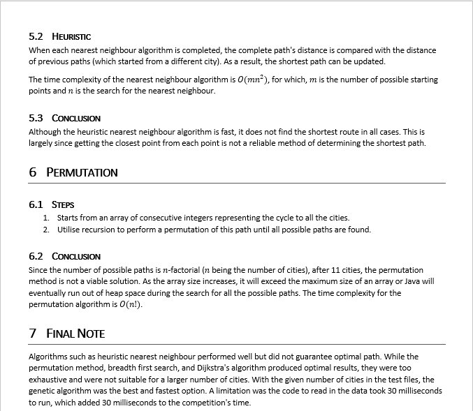

# Travelling-Salesman-Problem

- Implemented a multi-threaded genetic algorithm that can find the shortest path between 20 cities in less than a second.
- Built algorithms that look for the optimal result by searching exhaustively (i.e. Dijkstra's, breadth-first search).
- Optimised nearest neighbors algorithm by 8%, which resulted in just an 8% deviation from the optimal path when applying the algorithm across all cities.

<u><b>Utilised:</b></u> Java, JUnit, Algorithms and Data Structures, OOP, Artificial Intelligence

### Artificial Intelligence Coursework, Third Year of Computer Science

